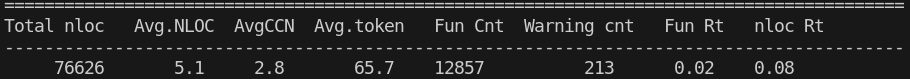

# Report for Assignment 1

## Project chosen

Name: MITMproxy

URL: https://github.com/mitmproxy

Number of lines of code and the tool used to count it: 506915; Lizard


Programming language: Python (84.4%)

## Coverage measurement

### Existing tool

The existing tool to run was the [coveragepy](https://github.com/nedbat/coveragepy/tree/7.5.3) library in Python.

To check the coverage, please look at existing_tool_coverage.txt.

### Your own coverage tool

Connor Kooistra

Function inside flow.py: Flow.kill() 

```
import atexit

coverage_data = {"kill_branch_1": False}

def write_coverage_data():
    with open(f"coverage_data_of_{Flow.kill.__name__}.txt", "w") as f:
        for branch, hit in coverage_data.items():
            status = "hit" if hit else "missed"
            f.write(f"{branch}: {status}\n")

atexit.register(write_coverage_data)
```

<Provide a screenshot of the coverage results output by the instrumentation>

<Function 2 name>

<Provide the same kind of information provided for Function 1>


<The following is supposed to be repeated for each group member>

<Group member name>

<Function 1 name>

<Show a patch (diff) or a link to a commit made in your forked repository that shows the instrumented code to gather coverage measurements>

<Provide a screenshot of the coverage results output by the instrumentation>

<Function 2 name>

<Provide the same kind of information provided for Function 1>

## Coverage improvement

### Individual tests

<The following is supposed to be repeated for each group member>

<Group member name>

<Test 1>

<Show a patch (diff) or a link to a commit made in your forked repository that shows the new/enhanced test>

<Provide a screenshot of the old coverage results (the same as you already showed above)>

<Provide a screenshot of the new coverage results>

<State the coverage improvement with a number and elaborate on why the coverage is improved>

<Test 2>

<Provide the same kind of information provided for Test 1>

### Overall

<Provide a screenshot of the old coverage results by running an existing tool (the same as you already showed above)>

<Provide a screenshot of the new coverage results by running the existing tool using all test modifications made by the group>

## Statement of individual contributions

<Write what each group member did>
